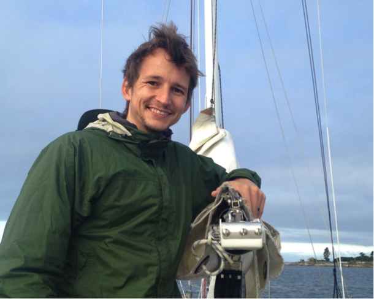

---
---

<h1>Staff: Willem Brussow</h1>

<h2>Job Description</h2>

Mechanical Lead

<h2>Summary of Responsibilities</h2>

Willem has extensive experience in operating and designing UAV’s. He has been with CfAR since its inception, in a design and pilot role. His primary responsibility is overseeing the mechanical design of a large scale technical demonstration vehicle being developed for Bombardier and NRC, as well as the mechanical design of AUV components.

<h2>Industry Sponsor</h2>

Bombardier

<h2>Personal interests and hobbies</h2>

Soccer, kiteboarding, sailing, cooking

